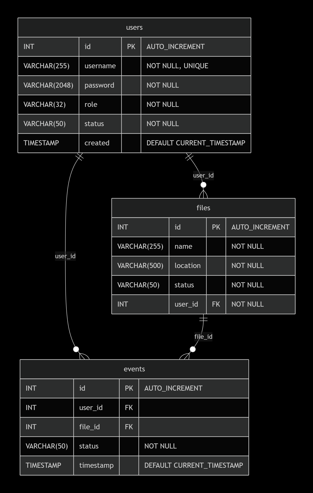

# Minio S3 File Manager

Проект разработан с применением реактивного REST API для файлового хранилища на базе MinIO S3 с системой аутентификации
и разграничением прав доступа

## Технологический стек

- Java 17+
- Spring Security
- Spring Data
- Spring WebFlux
- AWS SDK
- Flyway
- MySQL
- Gradle
- Docker
- Junit
- Testcontainers
- Swagger/OpenAPI

## Порядок запуска

1. Склонировать репозиторий:

    ```shell
    $ git clone
    ```

2. В папке src/main/resources в файле application.properties задать свои параметры:

   ```properties
    ```

3. Последовательно выполнить следующие команды, находясь в корне склонированного проекта:

   ```shell
    $ mvn clean package
    $ java -jar target/filemanager-1.0-SNAPSHOT-jar-with-dependencies.jar
   ```

## Система ролей и прав доступа

### ADMIN

- Полный доступ ко всем операциям
- Управление пользователями
- Просмотр всех файлов и событий
- Модерация контента

### MODERATOR

- Чтение всех пользователей
- CRUD операции со всеми событиями
- CRUD операции со всеми файлами
- Доступ к своим данным

### USER

- Чтение своих данных
- Загрузка файлов для себя
- Просмотр своих файлов и событий

## Диаграмма последовательности загрузки файлов


## Схема базы данных



